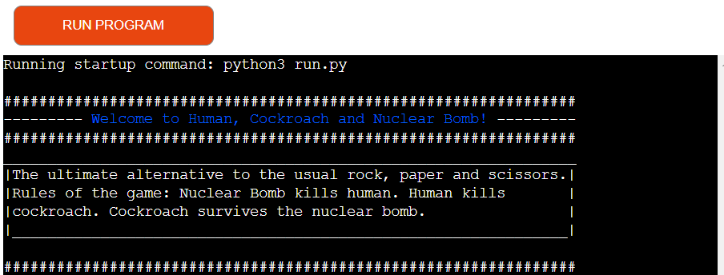

# Cockroaches & Nuclear Bomb

## About Cockroaches & Nuclear Bomb
Nuclear Bomb cockroaches is a back end browser game developed in Python. The game came to revolutionize the way we play rock, paper and scissors. 

Link to live website: [Cockroaches & Nuclear Bomb](https://cockroaches-nuclear-bombs.herokuapp.com/)

## Table of Contents
- [Features](#features)
    * [Features to be Implemented](#features-to-be-implemented)
- [User Experience (UX)](#user-experience-ux)
- [Data Model](#data-model)
- [Flowchart Skeleton Plan](#flowchart)
- [Testing](#testing)
    * [Component level Testing](#component-level-testing)
    * [User level Testing](#user-level-testing)
    * [Bugs](#bugs)
    * [Validator Testing](#validator-testing)
    * [Accessibility](#accessibility)
- [Deployment](#deployment)
- [Design](#design)
- [Technologies Used](#technologies-used)
- [Credits](#credits)
- [Acknowledgements](#acknowledgements)

## Features

- Game Introduction section
    - The first section of the game introduces the user to the game, the objects of the game and its rules. It makes mention to the rock, paper and scissors game so that the user knows what to wait in terms of game format. 

        

- Battle name input
    - The game asks the user to log their battle name to start the game. The battle name can have a maximum of 20 characters and no spaces. If the battle name require spaces, this must be replaced by an underscore. 

        

    - Whenever a user inputs a battle name that is not valid (longer than 20 characters and/or with spaces) the game prints an error with an appropriate message. 

        

    - After the battle name is entered correctly the game affirms the validation of the game by printing a welcome message to the user. 

        

- Weapon choice input
    - The second user input field from the game will ask the user to pick their ‘weapon’ for the battle. The options are Human, Cockroach, and Nuclear Bomb. The user must type the capitalized initial(s) of each weapon to select the respective weapon for battle. 

        

    - If the character typed is not a valid one it will give an error message and repeat the instructions to provide a valid weapon choice.   

        

    - When the weapon choice is selected correctly and validated, it will immediately open the battle outcomes. 

- Enemy’s data
    - In the background, two functions are making sure to get a random name battle for the computer as well as a random weapon choice. 

- Battle outcome & Score Board

    - The battle floor will display the choice of both user (player) and computer (enemy) on the table with a small text art representing the choices respectively. 

    - Under the battle floor the game will display the final result of this battle by telling the user if they have won, lost or if it was a tie.  

    - The score board will then designate a point to the appropriate winner of the battle.

        

- Play again question input  
    - After the first round of the battle the user will be asked if he would like to play another round. He is asked to type the capitalized initials of ‘ Y’  for yes and ‘N’ for no. 

    - An error will print in case the character types does not match the valid characters.

        

    - If the player types ‘Y’ the game will restart by only running the appropriate functions. This means the game will ask for the weapon choice of the play again and continue working with the same score, but will not ask for the player’s battle name again nor it will generate a new name for the enemy.

    - If the player types ‘N’ the game will end and print the overview of the battle(s) for the player. 

        

### Features to be implemented

- Implement a best of 3 or best of 5 game format where a player/enemy can play several rounds until the first scores 3 or 5 points – then the game will reset. 

- Display at the introduction to every new game (next to the instructions box) the battle name and score of the previous player.  

## User Experience (UX)
The user experience for the game is built with 2 personas in mind. Each persona presents a different user story and different goals when accessing the website. 

- Personas 
    - Persona 1: Code Institute project evaluators
    - Persona 2: Rock, paper and scissors fanatic players 

- About the game
Have you ever thought to yourself “I wish there was a more fun way to play rock paper and scissors”. Or did you also never really understood why does a paper win from a rock anyways?  Well, then this game is for you! Cockroaches and Nuclear Bomb brings a fun new way of playing a classic game while using actual science to explain why certain ‘objects’ win from the others. Don’t stand there just waiting, and go play our game now!  

- User stories

    - A Code Institute project evaluator:
        - I evaluate on a regular basis hundreds of rock, paper and scissors games.
        - I know all the different ways in which someone can build a rock, paper and scissors game in Python.
        - If I have to assess another rock paper and scissors game, I hope it has something new to it so I get some excitement from it.
        - I want to be entertained and laugh a bit while assessing a new project.

    - A Rock, paper and scissors fanatic player:
        - I already know everything there is to know about rock, paper and scissors.
        - I like the different variations of the rock, paper and scissors games, such as: rock, paper, scissors, lizard, spock (Big Bang Theory).
        - I am always looking for a new way to play rock, paper and scissors.

- Cockroaches and Nuclear Bomb goals with the game:
    - The application provides a fun new way to play one of the most classic games worldwide. 

## Data Model

The game is made from a Player class. The object player is created at the very beggining of the game, and its instances and attributes are given values as the game runs.

The Player class has 6 attributes who are stored and changed in different ways to be used throughout the code. 

- player_battle_name: it is generated via user input at the beginning of every game and it stays the same for as many rounds as the player decides to play. 

- enemys_battle_name: it is generated a random selection from within a list of oprtions at the beginning of every game and it stays the same for as many rounds as the player decides to play.

- players_weapon: it is generated via user input and it changes at every new round the player decides to play.  
- enemys_weapon: it is generated via a random selection and it changes at every new round the player decides to play.

- player_score: it starts at 0 and will increase 1 point for every round the player wins from the enemy.
- enemy_score: it starts at 0 and will increase 1 point for every round the player loses from the enemy.

## Flowchart Skeleton Plan

The fowchart was created for better visualising the steps requiredto develop the game, and thinking along in terms of how to approach each step with a different python functionality. I created this flowchart detailing the key moments that woud be printed to the terminal and create the flow of the game to the user.

## Testing

### Component level Testing
- The website was tested and it is working on different browsers: Google Chrome, Firefox, and Microsoft Edge.

### User level Testing
- Friends of mine tested the game for feedback. They reported that after a couple of rounds playing the game the terminal could get quite crowded and the text art to represent the different weapon objects were cut in half. To overcome this I have implemented a clear method to clear the terminal at every input stage of the user. 

### Bugs
While building the website some code was not behaving as expected. This happened mostly because of the order of functions being called and order in which variables were defined. Some other bugs I encountered were:

- I created the object player as part of the class Player. My idea was to first create the object and then slowly assign the values to it as the code/game runs. This was not possible because I was using the _init__ method. To make the adaptation I decided to use direct variables inside the class Player. 

- After deployment there was a bug that would append parts of my code to the top of the terminal even though I was using a clear method to clear the entire terminal. This was quite a difficult one to fix because this bug was not happening on my gitpod terminal. After a couple of hours on tutoring session, specially trying to replace the os clear method into different code lines to see if it would have any effect, we realized the bug was actually from the heroku terminal itself. I have then adapted the amount of rows available in the terminal deployed version for the code to run without any issues. 

### Validator Testing

- Python
    - No errors or warnings returned from the [PEP8 Online validator service](http://pep8online.com/)

### Accessibility

- The colors used in some parts of the code displayed in the terminal were tested for good contrast on [WebAIM](https://webaim.org/resources/contrastchecker/)

## Deployment

The website was deployed using Heroku. For that, the following steps were taken:

1. All user input fields on the python code received a new line (\n) at the end of their input request.
2. Requirements were installed into the requirements.txt file using pip3 freeze > requirements.txt.
3. On Heroku’s main page clicked on 'New' and then 'Create New App'.
4. The project was given a unique name to match the GitHub repository and a region was selected based on my location. The project is then created by Heroku.
5.  With the project created, navigate to settings and add a config var with KEY input field ‘PORT’ and VALUE input field '8000'.
6. Scroll down right under the config var section and select to add a buildpack. A pop up window will open where the Python icon is selected, and then the process is repeated to select the node.js buildpack. In this exact order so that the Python buildpack appears on top of the node.js buildpack.
7. Back at the the deploy tab GitHub was chosen as deploy method. This required me to give Heroku access to my GitHub account. 
8. After connecting to GitHub, the name of the repository to be deployed is chosen and confirmed by Heroku. 
9. The ‘Manual deploy’ method was selected as a way to keep track of changes and bugs that appear in the code. This allows you to also check the build of the app in an auto scroll window. 
10. After the deployment is complete, a message “Your app was successfully deployed.” is displayed. This will provide a button with a link to the live app. 
11. For any changes that happened in the code prior to the submission of this project, the manual deployment is updated using the main branch from GitHub.  

- Forking
    - To use this project as a reference or starting point, or even to propose changes to it, you can fork this repository by following these steps: 
        1. From the GitHub repository page click on 'Fork' in the top-right corner.
        2. Create a new repository with a new name based on this project. 
        3. Make sure to credit the project in case you decide to use any of the original code.

## Design

- Colors
    - The game uses colors on the text to provide some contrast between the different information presented within the game. It makes therefore more clear to follow and easy to read without the feeling of being too much code or overwhelming. 

- Text Art
    - The text art used in this game to represent the Human, the Cockroach and the Nuclear Bomb were taken from [ASCIIART ART ARCHIEVE](https://www.asciiart.eu/) and adapted by myself to better suit the game purposes and sizes. 

## Technologies Used

- Languages
    - [Python](https://en.wikipedia.org/wiki/Python)

- Libraries & Frameworks
    - os: The os library was imported to utilize the os.system functionality to clear the terminal at any moment when there is a user input. This creates a less crowded terminal and more clean and clear for the game purposes. 

    - random: The random library was imported to access values of a list by generating a random selection. This specifically concerns the selection of a battle name and a weapon for the computer/enemy.

    - colored: The [colored library](https://pypi.org/project/colored/) was imported to add color and formatting in the terminal. 

- Tools
    - [Gitpod](https://www.gitpod.io/)
    - [Github](https://github.com/)
    - [Google Chrome Developer Tools](https://developer.chrome.com/docs/devtools/)
    - [ASCIIART ART ARCHIEVE](https://www.asciiart.eu/)
    - [PEP8 online python validator](http://pep8online.com/)
    - [Am I Responsive?](http://ami.responsivedesign.is/)
    - [WebAIM](https://webaim.org/resources/contrastchecker/)

 ## Credits

- Content
 
    - All text art in this game wask taken from [ASCIIART ART ARCHIEVE](https://www.asciiart.eu/) and adapted by me into smaller scale.

    - The os.system functionality to clear the terminal: os.system('cls' if os.name == 'nt' else 'clear') was an idea given to me by the CI Slack community, after we were discussing howI could improve readibility in the terminal after many game rounds. 
    
    - All other code was written by myself: Ana Ramos Barretto.

## Acknowledgements

A huge thanks to my mentor Samantha Dartnall, the CI slack community and tutoring team (specially Scott!), and my family and friends who tested the game at least a couple hundred times. 
